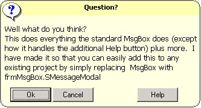



## MsgBox and InputBox Replacement \(Release 2\.0\)

### Description

Update 11-24-03 This does everything the standard msgbox does plus more and it is all in one file. It uses all the standard parameters for selecting the buttons, icons and sounds; which means it is a direct replacement for the standard msgbox. It automatically adjusts its size based on the amount of text to display (in the caption or the body of the message). What makes it different are the following:

1.	Display it centered or at the current mouse position.

2.	Display it with no buttons and close it through code only.

3.	Display it so that it automatically closes after a specified number of seconds.

4.	Display it as a modal or non-modal form.

5.	Display 5 additional system icons.

6.	Uses a more modern look, rounded corners and a yellow background to make it easer to read.

7.	The special Help button is treated as any other button, returning a value when pressed.

8.	The Ok button is not shown by default. You need to add the vbOkButton parameter to make it show.

9.	NEW: Added an Inputbox function (frmMsgBox.sInputBox) with the same look and feel as the msgbox.
 
### More Info
 

             |
---                |---
**Submitted On**   |2004-04-05 08:21:24
**By**             |[Morgan Haueisen](https://github.com/Planet-Source-Code/PSCIndex/blob/master/ByAuthor/morgan-haueisen.md)
**Level**          |Advanced
**User Rating**    |5.0 (55 globes from 11 users)
**Compatibility**  |VB 6\.0
**Category**       |[VB function enhancement](https://github.com/Planet-Source-Code/PSCIndex/blob/master/ByCategory/vb-function-enhancement__1-25.md)
**World**          |[Visual Basic](https://github.com/Planet-Source-Code/PSCIndex/blob/master/ByWorld/visual-basic.md)
**Archive File**   |[MsgBox\_and172890452004\.zip](https://github.com/Planet-Source-Code/morgan-haueisen-msgbox-and-inputbox-replacement-release-2-0__1-48289/archive/master.zip)

